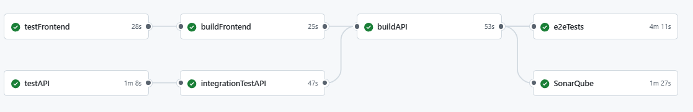

8. Crosscutting Concepts
=====================

REST API Design Patterns
------------------------
.. image:: pic/MCV.drawio.svg
   :alt: MCV Pattern
   :width: 1000px

- **Controller:** Handles HTTP protocol, validates DTOs (Data Transfer Objects), and routes requests.
- **Service:** Contains business logic, transforms DTOs to Models, and vice versa.
- **Mapper:** Converts between DTOs and Models, ensuring data consistency and separation of concerns.
- **Repository:** Provides data access methods for interacting with the database.
- **Naming Conventions:**
  - DTOs: `In<ModelName>Dto` or `ContextInDto`, `Out<ModelName>Dto` or `ContextOutDto.java`.
  - Service, Controller, Repository, Mapper: `<Type><Model>.java` (e.g., `UserService.java`, `UserController.java`).
- **MVC Principle:**
  - The system follows the Model-View-Controller pattern, separating data (Model), user interface (View), and request handling/business logic (Controller).

User Anonymisation and protection
~~~~~~~~~~~~~~~~~
- When user data is requested by others, only non-sensitive fields are returned: `ID`, `username`, and `image`.
- Sensitive data (such as email) is never exposed via the API to protect user privacy.
- Data posted by a user can only be deleted and updated by the user itself or an admin.

API URL Schema
~~~~~~~~~~~~~~~~~
- **GET, PUT, DELETE:**
  - `http://<host>:<port>/api/<version>/<resource>/<ID>`
  - The `<ID>` is omitted if the resource is directly linked to the user (e.g., profile).
- **POST:**
  - `http://<host>:<port>/api/<version>/<resource>`
  - Used for creating new resources.

Frontend Concepts
-----------------
.. image:: pic/Component_Class.drawio.svg
   :alt: Show the basic structure of the frontend
   :width: 1000px

- **Pages and Components:**
| - Pages represent main views/routes; components are reusable UI elements used within pages.
| - This structure promotes reusability and maintainability.

- **Basic Structure:**
| - The frontend is organized into pages, components, utilities, and assets.
| - A **page** renders it html based on the contained components that are usualy fetched from the Rest API.
| - The **component** simulary may also fetch and render futher containing components based on the data of the Rest API.
| - Both pages and components use the UseEffect hock to trigger and load data from the Rest API.
| - Both pages and components have to provide a handler for updates of containig components to ensure that the UI is updated when the data changes.

- **UI Consistency:**
| - FontAwesome, Bootstrap, and Motion are used to create a visually appealing and consistent UI.
| - These libraries should always be used when writing HTML code to ensure design consistency.

Testing Concepts
----------------
- **Unit Tests:**  Use Junit5 and Mockito for testing the backend.
- **Frontend Unit Tests:**  Use Vitest for testing the frontend components.
- **Architecture Tests:** Use archunit to ensure MVC consistency, naming conventions, and presence of Swagger/validation annotations.
- **Integration Tests:** Use Testcontainers ro test REST endpoints to verify that components work together and data is consistent.
- **End-to-End (E2E) Tests:** Use Playwright to ensure the entire stack (UI to backend) works as expected.

Pipeline
--------

The CI/CD pipeline is defined in the GitHub Actions workflow and is triggered automatically on:
- Pushes ro any branch
- Pull requests targeting the `main` branch

Pipeline Structure and Rationale
~~~~~~~~~~~~~~~~~~~~~~~~~~~~~~~
- **testAPI:** Runs unit tests for the backend using Maven and generates a JaCoCo code coverage report. Ensures code quality and instruction coverage of 80% before further steps.
- **integrationTestAPI:** Runs integration tests for the backend, including database and security checks, using Testcontainers. Ensures that backend components work together as expected.
- **buildAPI:** Builds the backend JAR after successful tests and uploads build artifacts. Also submits a dependency graph for security insights.
- **sonarqube:** Performs static code analysis and quality checks using SonarQube, helping to maintain code quality and detect issues early (only availabel on main branch).
- **testFrontend:** Runs frontend unit and ensure a instruction coverage of 80% .
- **buildFrontend:** Builds the frontend application after successful tests, ensuring only tested code is deployed.
- **e2eTests:** Runs end-to-end tests using Playwright, spinning up the full stack with Docker Compose to verify that the system works as a whole from the user's perspective.

This structure ensures that code is tested at multiple levels (unit, integration, E2E), analyzed for quality, and only built and deployed if all checks pass, supporting robust and reliable software delivery.