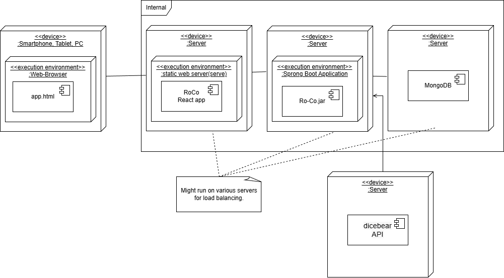

3. Context and Scope
===================================

3.1 Business Context:
-----------------------
.. image:: pic/Ro-Co-delimiter.png
   :alt: Ro-Co delimiter diagram
   :width: 800px

- **System Boundary**: The Ro-Co system is defined by its web application, which includes the frontend (user interface) and backend (server-side logic and database).
- **REST API**: The system provides a RESTful API that allows users and administartors to directly interact with the system, enabling a frontend independent access to the system's functionality.
- **Roles**: The system distinguishes between different user roles, such as regular users and administrators.
- **External Devices**: The system is designed to be accessible from various devices, including smartphones, tablets, and desktop computers.
- **External Services**: The system is integrated with the `DiceBear <https://www.dicebear.com/>`__ service for generating user avatars (We are currently working on resolving this external dependency).
- **The Database System**: Only for backend services, never accessed directly by users or damins. 

3.2 Technical Context:
-----------------------

+-------------------+---------------------------------------------------------------+
| Component         | Description                                                   |
+===================+===============================================================+
| Web Browser       | Executes JavaScript locally and renders HTML for the user.    |
+-------------------+---------------------------------------------------------------+
| Static Web Server | Provides HTML and JavaScript files to browsers.               |
+-------------------+---------------------------------------------------------------+
| Spring Boot       | Provides a REST API to interact with JSON resources.          |
+-------------------+---------------------------------------------------------------+
| MongoDB           | Stores data using a file-based approach.                      |
+-------------------+---------------------------------------------------------------+
| DicebearAPI       | Provides access to seeded avatar images.                      |
+-------------------+---------------------------------------------------------------+

Interface Deinition
~~~~~~~~~~~~~~~~~~~~~~~~
We provide two main interfaces for interacting with the Ro-Co system:
- **Web Interface**: The primary interface for users, allowing them to interact with the system through a web browser. This interface uses http protocl and is accessible on various devices for **chrome** and **firefox** based browsers.
- **REST API**: A programmatic interface that allows developers to interact with the system's functionality directly. This API is designed to get, post, put and delete REST resource via JSON objects to integrate with the backend. A detailed API documentation can be accessed via the swagger UI at http://.../api.html at runtime.